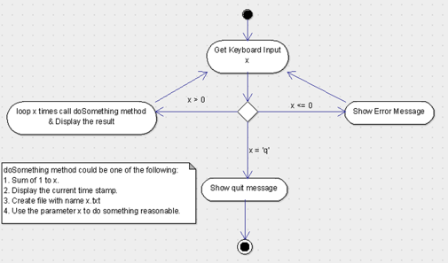

1. What is JDK? JRE? JVM?
- JDK (Java Development Kit) is a Kit that provides the environment to develop and execute(run) the Java program. 
JDK is a kit(or package) that includes two things:Development Tools(to provide an environment to develop your java programs)
and JRE (to execute your java program).
- JRE (Java Runtime Environment) is an installation package that provides an environment to only run(not develop) the java 
program(or application)onto your machine. JRE is only used by those who only want to run Java programs that are end-users of your system.
- JVM (Java Virtual Machine) is a very important part of both JDK and JRE because it is contained or inbuilt in both. Whatever Java program you run using JRE or JDK goes into JVM and JVM is responsible for executing the java program line by line, hence it is also known as an interpreter.

2. What is java compiler?
- A compiler in Java is a computer program that is used for compiling Java programs. It is platform-independent. It converts (translates) source code (.java file) into bytecode (.class file).
In other words, the compiler (javac.exe) generates bytecode during the compilation process.

3. Why is java platform independent?
- Java language was developed in such a way that it does not depend on any hardware or software due to the fact that the compiler compiles the code and then converts it to platform-independent byte code which can be run on multiple systems.
The only condition to run that byte code is for the machine to have a runtime environment (JRE) installed in it.

4. What is IDE? Why is it important for developers?
- An IDE, or Integrated Development Environment, enables programmers to consolidate the different aspects of writing a computer program. IDEs increase programmer productivity by combining common activities of writing software into a single application: editing source code, building executables, and debugging.

5. Is java case sensitive?
- Java is a case-sensitive language, which means that the upper or lower case of letters in your Java programs matter. 

6.What do the following key words do? static, final, public, private, void, null, package, Class, new
7. What is primitive type and reference type?
8. Is parameter passed by value or reference?
9. What is the output: System.out.println(1 > 0 : “A”:”B”);
10. How to define constants in java?
11. What is String? Is it primitive type?
12. How to check if a String is representing a number?
13. Write a program to implement the following activity diagram:

14. Write a program to merge two array of int.
15. Write a program to find the second largest number inside an array of int.

