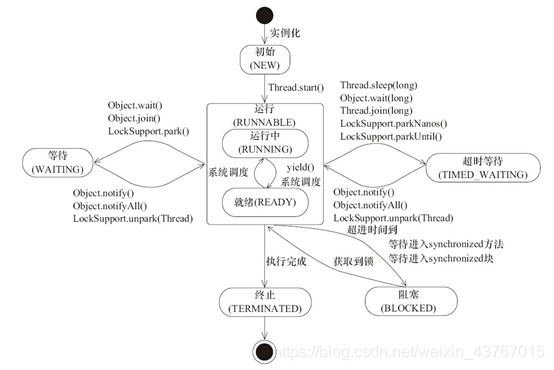

### process vs thread
1. process
- independent memory space, heap, OS resources

2. thread
- public: shared memory space
- private: stack, program counter, register

### threads state
1. new
- create thread
- not start yet
2. runnable
- call start() method
- include running and ready state of OS
- maybe is running, maybe is ready for running (waiting for CPU to execute)
3. blocked
- wait for a monitor lock to enter synchronized block or method
4. waiting
- Object.wait() with no timeout -> Object.notify(), Object.notifyAll()
- Object.join() with no timeout
- LockSupport.park() -> LockSupport.unpark(Thread)
- I/O blocked
5. timed_waiting
- Thread.sleep(long millis)) with timeout
- Object.wait(long millis) with timeout -> Object.notify(), Object.notifyAll()
- Object.join(long millis) with timeout
- LockSupport.parkNanos(long nanos) -> LockSupport.unpark(Thread)
- LockSupport.parkUntil(long deadline) -> LockSupport.unpark(Thread)
6. terminated
- completed
- exception

### Thread creation
1. types 
- extends Thread class 
- implements Runnable interface (FunctionalInterface, lambda)
- implements Callable interface
- thread pool

2. Runnable vs Callable

   | Runnable    | Callable                               |
   |----------------------------------------| ----------- |
   | java.lang   |  java.util.concurrent
   | run()      | call()                                 |
   | no return   | return, the object of FutureTask.get() |
   | does not support throws exception, just try catch| support throws exception and try catch|
   |            | neet to create object of FutureTask|

3. customized thread pool 
- java.uitl.concurrent.ThreadPoolExecutor

5. in-built thread pool
- ExecutorService executor = Executors.newFixedThreadPool(5);
newSingleThreadPool()
newCachedThreadPool()
newScheduledThreadPool(3)

  
### Lock

1. synchronized 
- Synchronization in java is the capability to control the access of multiple threads to any shared resource. In the Multithreading concept, multiple threads try to access the shared resources at a time to produce inconsistent results. The synchronization is necessary for reliable communication between threads.

2. Lock
- A lock is a thread synchronization mechanism like synchronized blocks except locks can be more sophisticated than Java's synchronized blocks. Locks (and other more advanced synchronization mechanisms) are created using synchronized blocks, so it is not like we can get totally rid of the synchronized keyword.

3.difference
- Lock is an interface, and Synchronized is the key word.
- Synchronized releases the lock automatically, and Lock must release the lock manually.
- Lock can interrupt the response of the thread waiting for the lock, but Synchronized will not, and the thread will wait all the time.
- Lock lets you know if a thread has a lock, but Synchronized can't.
- Lock can improve the efficiency of multiple threads.
- Synchronized locks classes, methods, and code blocks, while Lock is block-wide
  
https://www.geeksforgeeks.org/lock-framework-vs-thread-synchronization-in-java/

### Lock interface
1. lock(), unlock(), newCondition(), tryLock(), lockInterruptibly()
- lock(): acquire the lock if it's available; if the lock isn't available a thread gets blocked until the lock is released
- unlock(): unlocks the Lock instance
- newCondition(): A Condition instance is intrinsically bound to a lock. To obtain a Condition instance for a particular Lock instance
- tryLock(): this is a non-blocking version of lock() method; it attempts to acquire the lock immediately, return true if locking succeeds
- lockInterruptibly(): this is similar to the lock(), but it allows the blocked thread to be interrupted and resume the execution through a thrown java.lang.InterruptedException
2. ReentrantLock class

### ReadWriteLock interface
1. method
- Lock readLock(): if no thread acquired the write lock or requested for it then multiple threads can acquire the read lock
- Lock writeLock(): if no threads are reading or writing then only one thread can acquire the write lock
2. ReentrantReadWriteLock
- ReentrantReadWriteLock is an implementation of ReadWriteLock. It gives write lock to the longest waiting thread if multiple thread are not waiting for read lock. If multiple threads are waiting for read lock, read lock is granted to them.

### Future vs CompletableFuture
- Future: A Future represents the result of an asynchronous computation. Methods are provided to check if the computation is complete, to wait for its completion, and to retrieve the result of the computation. The result can only be retrieved using method get when the computation has completed, blocking if necessary until it is ready. Cancellation is performed by the cancel method. Additional methods are provided to determine if the task completed normally or was cancelled. Once a computation has completed, the computation cannot be cancelled. If you would like to use a Future for the sake of cancellability but not provide a usable result, you can declare types of the form Future<?> and return null as a result of the underlying task.
- A Future interface provides methods to check if the computation is complete, to wait for its completion and to retrieve the results of the computation.

- CompletableFuture: Along with the Future interface, it also implemented the CompletionStage interface. This interface defines the contract for an asynchronous computation step that we can combine with other steps.

